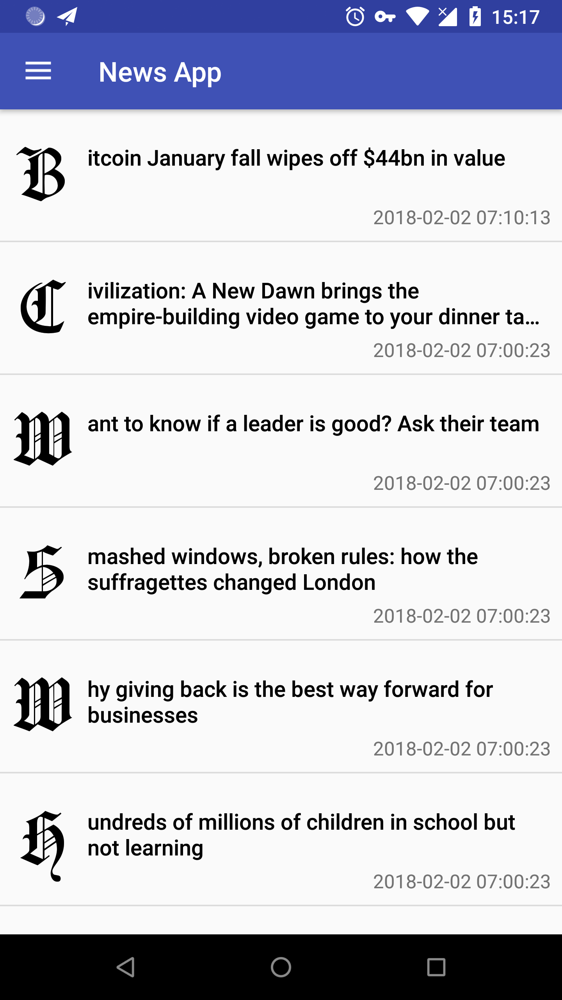
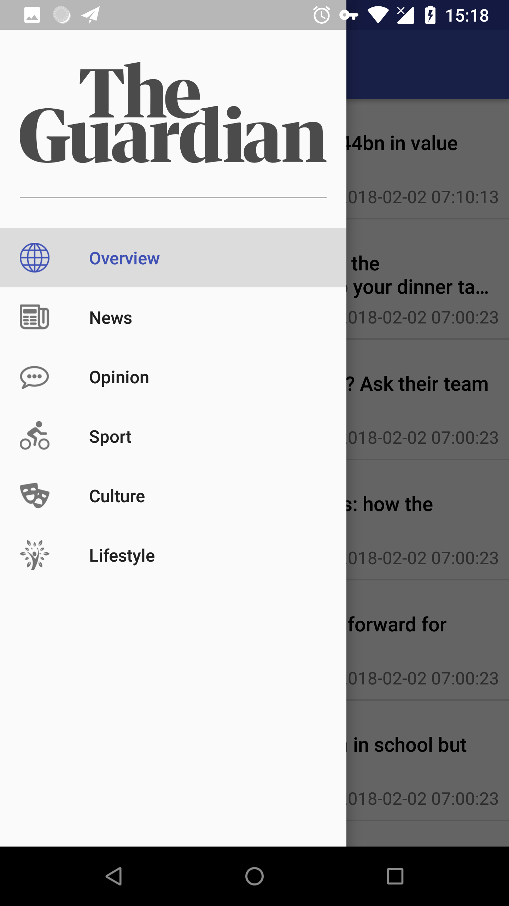
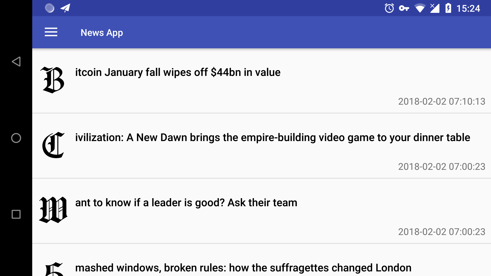
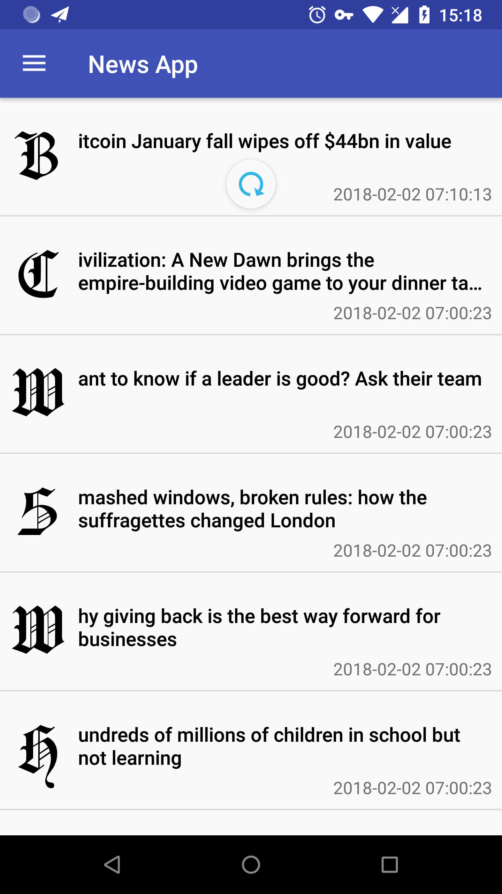
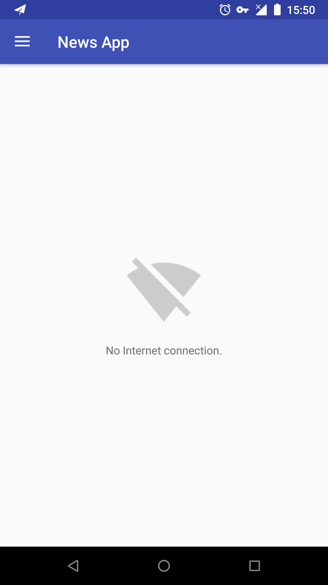
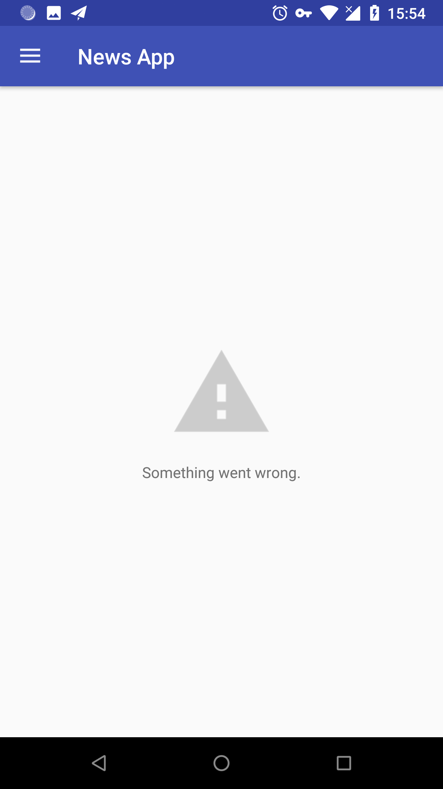
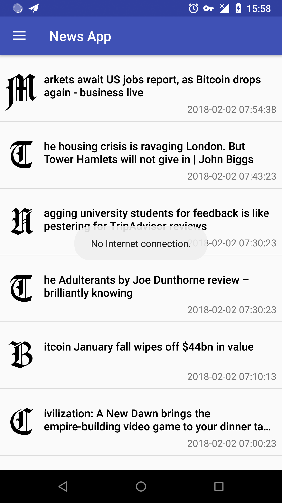

02/02/18: Initiate Commit.

This project is an Android News App fetching data from [the Guardian API](http://open-platform.theguardian.com/).

1. The main screen of the app displays a list of news with the title and the publication time of each news. Users can touch each news and intent to browser with the Guardian URL.
2. By implementing `RecyclerView.OnScrollListener`, the app provides a endless scrolling list experience.
3. The Guardian API return the news time in ISO-8601 format, the app uses `SimpleDateFormat` to format the time.
4. THe initial letter uses Hansa Gotisch font from [Font Meme](https://fontmeme.com/fonts/hansa-gotisch-font/).

1. The app uses navigation drawer to switch different topics of news. The first "Overview" item is selected by default.
2. The Guardian API provides 73 sections according to its response. The app only uses five sections which appear on [the Guardian Homepage](https://www.theguardian.com/international).
3. When users switchover other topics of news, the list will scroll back to the top.

The app supports lanscape mode. However, when the list loads more than one page, switching device's orientation mode, the app only maintains the last page's contents. I believe this issue can be sovled after the next lesson, so I'll leave it for now.

The app uses `SwipeRefreshLayout` as the loading indicator and supports the "Pull to Refresh" gesture to get the latest news.

 

When the device is not connected to Internet or something wrong with the data request, the app will display the corresponding empty state view to users.

If there are contents on screen, users pull to refresh or scroll to the bottom of the list when the device is disconnected, the app will make a `Toast` to inform users that the current situation.

This is a training project in Udacity's Android Basics Nanodegree program.  
Check out this and other courses here: https://www.udacity.com/courses/all